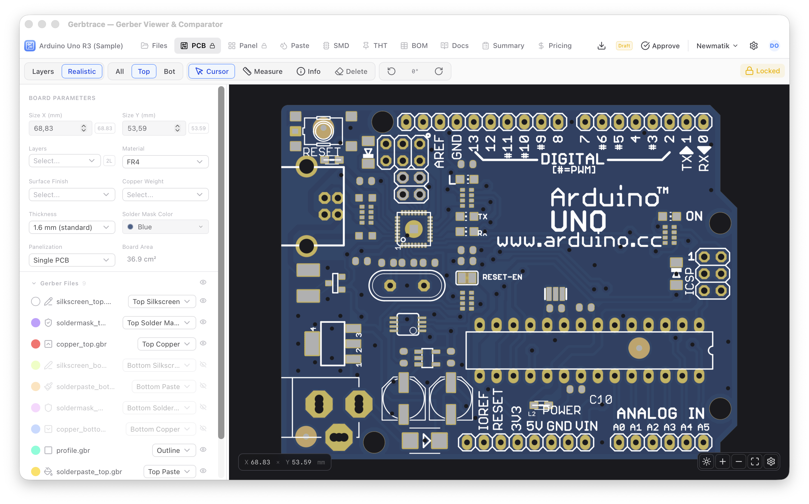
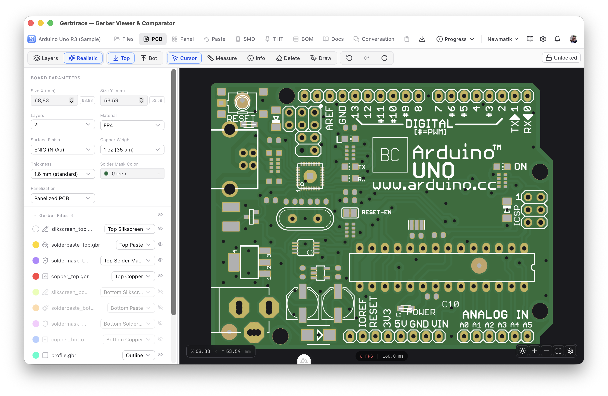
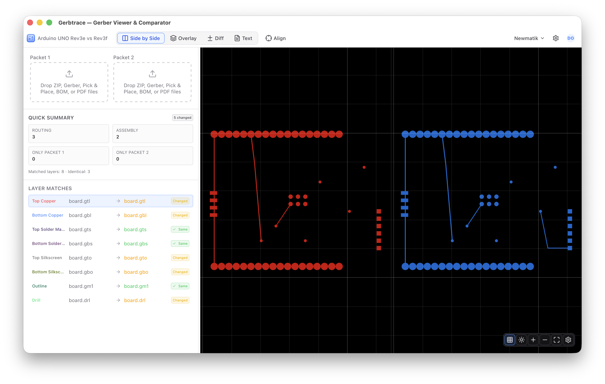
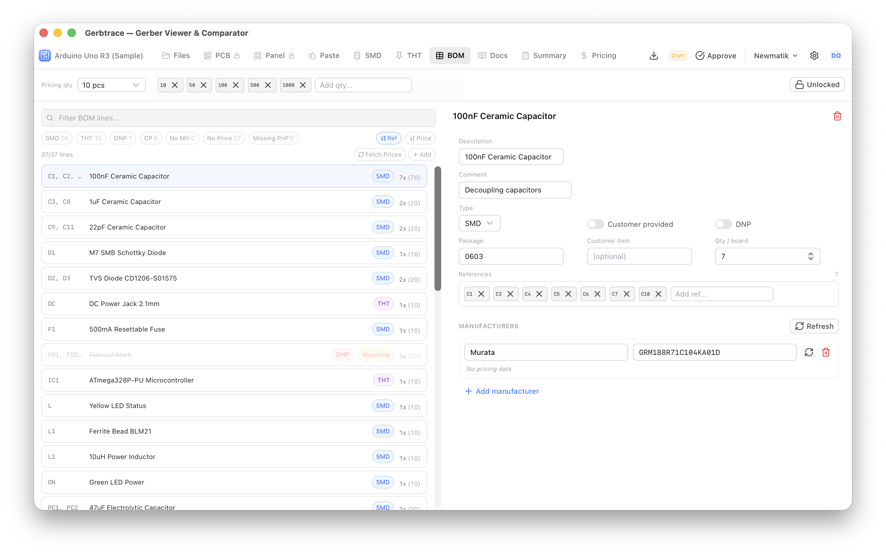
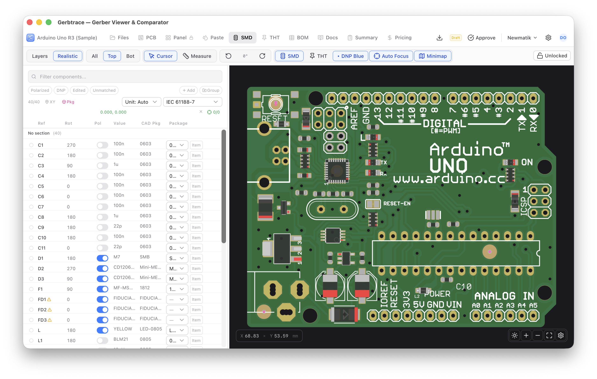
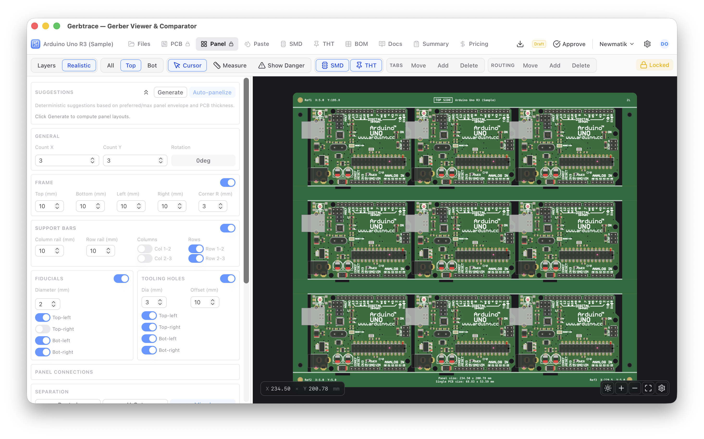

<h1> Gerbtrace</h1>

**Drop a Gerber file. See your board.** That's it — no sign-up, no upload, nothing to install. Gerbtrace is a free Gerber viewer and comparison tool that runs entirely in your browser.

Need more? Gerbtrace is also a complete New Product Introduction (NPI) platform for electronics manufacturing — BOM management, Pick and Place, panelization, paste configuration, pricing estimation, and team collaboration. Use as much or as little as you need.

[Web App](https://www.www.gerbtrace.com) · [Desktop Downloads](https://github.com/newmatik/gerbtrace/releases) · [Documentation](https://www.gerbtrace.com/docs)

<picture>
  <source media="(prefers-color-scheme: dark)" srcset="public/images/docs/pcb-realistic-dark.png">
  <source media="(prefers-color-scheme: light)" srcset="public/images/docs/pcb-realistic-light.png">
  
</picture>

## Built by a PCBA Company

Gerbtrace is built and maintained by **[Newmatik](https://www.newmatik.com)**, a Swiss PCBA company specialized in rapid prototyping and small-series electronics manufacturing. We use Gerbtrace every day to prepare production data for our customers' boards. The tool exists because we needed it — and we think you might too.

## View and Compare — No Setup Required

Open [www.gerbtrace.com](https://www.gerbtrace.com), drag in a `.zip` of Gerber files, and you're looking at your PCB. That workflow is the heart of Gerbtrace and it will always be free.

### Gerber Viewer

Render and inspect PCB layers with a full-featured canvas. Standard mode composites layers with configurable colors; realistic mode simulates the physical board appearance with copper, solder mask, silkscreen, and surface finish. Canvas tools include measurement, element inspection, drawing, cropping, rotation, and grid overlays.

<picture>
  <source media="(prefers-color-scheme: dark)" srcset="public/images/docs/pcb-dark.png">
  <source media="(prefers-color-scheme: light)" srcset="public/images/docs/pcb-light.png">
  
</picture>

### Revision Comparison

Compare two Gerber packages across four modes: side-by-side with synchronized pan/zoom, overlay toggle that blinks between revisions, pixel diff that highlights added (green) and removed (red) geometry, and text diff for line-by-line Gerber source comparison. Includes automatic layer matching, SHA-256 identical file detection, and coordinate alignment tools.

<picture>
  <source media="(prefers-color-scheme: dark)" srcset="public/images/docs/compare-side-by-side-dark.png">
  <source media="(prefers-color-scheme: light)" srcset="public/images/docs/compare-side-by-side-light.png">
  
</picture>

## Full NPI Suite — When You're Ready

When a quick look isn't enough, Gerbtrace scales into a production data preparation platform that covers the entire journey from design handoff to factory floor.

### Bill of Materials

Import BOM data from CSV, TSV, or Excel files. Organize lines into named groups with drag-and-drop. Enrich data with AI-powered suggestions (description, type, manufacturer, second source). Fetch live distributor pricing via the Elexess API across multiple suppliers. Cross-reference against Pick and Place data to surface mismatches.

<picture>
  <source media="(prefers-color-scheme: dark)" srcset="public/images/docs/bom-panel-dark.png">
  <source media="(prefers-color-scheme: light)" srcset="public/images/docs/bom-panel-light.png">
  
</picture>

### Pick and Place

Visualize SMD and THT component placement on the board with body outlines, pad geometry, and pin-1 markers. Bidirectional highlighting links the component list and the canvas. Manage rotations, polarity, DNP status, and package assignments. Supports Mycronic, IPC-7351, and IEC 61188-7 conventions with automatic conversion.

<picture>
  <source media="(prefers-color-scheme: dark)" srcset="public/images/docs/smd-components-dark.png">
  <source media="(prefers-color-scheme: light)" srcset="public/images/docs/smd-components-light.png">
  
</picture>

### Panelization

Visual panel editor with configurable grid layout, independent frame rail widths, fiducials, tooling holes, tabs with mouse bite perforation, routing channels, V-cut, and support bars. The suggestion engine computes optimal grid configurations based on your preferred panel envelope. Live canvas preview updates as you edit.

<picture>
  <source media="(prefers-color-scheme: dark)" srcset="public/images/docs/panel-overview-dark.png">
  <source media="(prefers-color-scheme: light)" srcset="public/images/docs/panel-overview-light.png">
  
</picture>

### Paste Configuration

Stencil and jet print modes with dot pattern preview. Export JPSys jet print programs for Mycronic jet printers.

### PCB Pricing

Fabrication and assembly cost estimation across configurable quantity tiers. Combines board parameters, BOM pricing, and panel configuration into per-piece and total cost breakdowns with NRE/tooling.

### Collaboration

Team workspaces with role-based access (admin, editor, viewer, guest). Spaces for scoping projects and packages to customers or product lines. Threaded project conversations with @-mentions and file attachments. Approval workflows, real-time presence, and notification inbox.

### Exports

Download production-ready data: Gerber ZIP packages, PNG/SVG board images, PnP placement files, DXF drawings for CAD, and JPSys jet print programs.

## Supported Formats

| Type | Formats |
|---|---|
| **Gerber RS-274X** | `.gtl` `.gbl` `.gts` `.gbs` `.gto` `.gbo` `.gtp` `.gbp` `.gm1` `.gko` `.gbr` |
| **Excellon Drill** | `.drl` `.drd` `.xln` `.exc` `.ncd` |
| **Pick and Place** | `.csv` `.tsv` `.txt` (auto-detected delimiter) |
| **Bill of Materials** | `.csv` `.tsv` `.txt` `.xlsx` `.xls` |
| **Documents** | `.pdf` (schematics, drawings, datasheets) |
| **Archives** | `.zip` (auto-extracted and classified) |

## Tech Stack

| Component | Technology |
|---|---|
| Framework | [Nuxt 4](https://nuxt.com) (SPA mode, SSR disabled) |
| UI Library | [Nuxt UI](https://ui.nuxt.com) + Tailwind CSS |
| Desktop | [Tauri 2](https://v2.tauri.app) (Rust) |
| Gerber Parsing | Custom RS-274X / Excellon lexer-parser-plotter pipeline |
| Rendering | Canvas 2D (standard + realistic) |
| Local Storage | [Dexie.js](https://dexie.org) (IndexedDB) |
| Backend | [Supabase](https://supabase.com) (Postgres, Auth, Storage, Realtime, Edge Functions) |
| Error Monitoring | [Sentry](https://sentry.io) |

## Quick Start

**Just want to view a board?** Open [www.gerbtrace.com](https://www.gerbtrace.com) and drop your Gerber ZIP. Done.

**Want the desktop app?** Download from [GitHub Releases](https://github.com/newmatik/gerbtrace/releases):

- **macOS** — `.dmg` (universal binary, Intel + Apple Silicon)
- **Windows** — `.msi` / `.exe`

The desktop app checks for updates automatically on launch. No uploads, no server — all processing stays on your machine.

## Development

### Prerequisites

- [Node.js](https://nodejs.org) 20 or later
- [Rust](https://rustup.rs) (only for desktop builds)

### Setup

```bash
git clone https://github.com/newmatik/gerbtrace.git
cd gerbtrace
npm install
```

### Web development

```bash
npm run dev
```

Visit `http://localhost:3000`.

### Desktop development

```bash
npm run tauri:dev
```

Launches a native window with hot reload. Changes to Vue files reflect immediately in the desktop window.

### Production build

```bash
# Static web app
npm run generate

# Desktop app for current platform
npm run tauri:build
```

### Environment variables

Create a `.env` file for Supabase connection (optional — local projects work without a backend):

```
SUPABASE_URL=https://your-project.supabase.co
SUPABASE_ANON_KEY=your-anon-key
```

See the [Development Setup](https://www.gerbtrace.com/docs/development/setup) guide for full details.

## Project Structure

```
gerbtrace/
  app/
    components/         Vue components organized by feature
    composables/        State management and business logic
    pages/              Route definitions
    utils/              Pure functions (parsing, geometry, formatting)
    workers/            Web Workers
  lib/
    gerber/             Gerber/drill tokenizer, parser, and plotter
    renderer/           Canvas 2D, realistic, SVG, DXF, and pixel diff renderers
  src-tauri/            Tauri desktop app (Rust)
  supabase/             Database migrations and edge functions
  content/              Documentation (Nuxt Content)
  public/               Static assets and package libraries
  scripts/              Build and maintenance scripts
  .github/workflows/    CI/CD (web deploy, desktop build)
```

## Contributing

1. Fork the repository and clone your fork.
2. Follow the [Development Setup](https://www.gerbtrace.com/docs/development/setup) guide.
3. Create a feature branch from `main`.
4. Make your changes and verify they work in both web and desktop modes.
5. Submit a pull request.

See the [Contributing](https://www.gerbtrace.com/docs/development/contributing) guide for coding conventions, the sidebar design system, and PR guidelines.

## Acknowledgments

- **[tracespace](https://github.com/tracespace/tracespace)** (MIT) — Gerber parser architecture inspired by tracespace's lexer-parser-plotter pipeline
- **[Ucamco](https://www.ucamco.com/en/gerber)** — Official Gerber Layer Format Specification
- **[Arduino](https://www.arduino.cc)** — Sample project uses Arduino UNO open-source hardware design

## License

Gerbtrace is source-available under the [Business Source License 1.1](LICENSE) (BUSL-1.1).

The BUSL is not an open-source license. It grants broad usage rights while protecting against competitive repackaging. Here is what that means in practice:

**You can:**

- Use Gerbtrace internally within your organization for any purpose, including production
- Read, study, modify, and learn from the source code
- Contribute improvements back via pull requests

**You cannot:**

- Offer Gerbtrace (or a modified version) to third parties as a competing product or service
- Rebrand and redistribute Gerbtrace as your own product to customers
- Embed Gerbtrace in a commercial offering that competes with Gerbtrace

**Automatic relicensing:** Each version of Gerbtrace automatically converts to the [MIT](https://opensource.org/licenses/MIT) license four years after its release date. This means every release will eventually become fully open source.

For alternative licensing arrangements, contact [software@newmatik.com](mailto:software@newmatik.com).

Copyright (c) 2025-2026 [Newmatik GmbH](https://www.newmatik.com)
