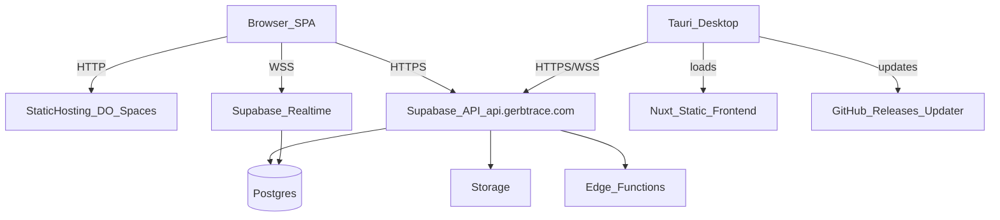
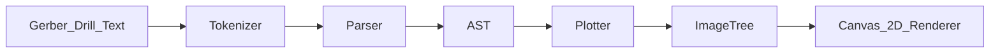

# Gerbtrace

A standalone, source-available Gerber file viewer and comparison tool by **[Newmatik GmbH](https://www.newmatik.com)**.

View and compare Gerber PCB files directly in your browser or as a native desktop app. No uploads, no server — everything stays local.

**Web App:** [gerbtrace.com](https://gerbtrace.com)  
**Desktop Downloads:** [GitHub Releases](https://github.com/newmatik/gerbtrace/releases)

## Features

### Viewer Mode

- Import Gerber file packages (ZIP or individual files)
- Auto-detect layer types from filenames
- Toggle layer visibility with color controls
- All visible layers composited on a single Canvas 2D view
- Pan/zoom with mouse wheel and drag

### Compare Mode

- Import two Gerber packages side by side
- Automatic layer matching with manual override
- Identical-file detection (SHA-256 hash)
- **Side by Side** — synced pan/zoom
- **Overlay Toggle** — blink between versions
- **Pixel Diff** — red (removed), green (added), gray (identical)
- **Text Diff** — line-by-line Gerber source comparison

### Desktop App (macOS & Windows)

- Native app built with [Tauri 2](https://v2.tauri.app)
- Automatic updates via GitHub Releases
- Window state persistence (size, position)
- Available as `.dmg` (macOS) and `.msi` / `.exe` (Windows)

## Installation

### Web

Visit [gerbtrace.com](https://gerbtrace.com) — no installation required.

### macOS

1. Download the latest `.dmg` from [GitHub Releases](https://github.com/newmatik/gerbtrace/releases)
2. Open the `.dmg` and drag **Gerbtrace** to your Applications folder
3. Launch from Applications

### Windows

1. Download the latest `.msi` or `.exe` installer from [GitHub Releases](https://github.com/newmatik/gerbtrace/releases)
2. Run the installer
3. Launch Gerbtrace from the Start menu

The desktop app checks for updates automatically on launch and notifies you when a new version is available.

## Development

### Prerequisites

- [Node.js](https://nodejs.org) 20+
- [Rust](https://rustup.rs) (for desktop app development only)

### Getting Started

```bash
# Install dependencies
npm install

# Start web development server
npm run dev
```

Visit `http://localhost:3000` in your browser.

### Desktop Development

```bash
# Start Tauri development (launches native window with hot reload)
npm run tauri:dev

# Build desktop app for your current platform
npm run tauri:build
```

### Build for Production

```bash
# Generate static web app
npm run generate
# Output: .output/public/
```

## Tech Stack

| Component | Technology |
|---|---|
| Framework | [Nuxt 4](https://nuxt.com) (SPA mode) |
| UI Library | [Nuxt UI 4](https://ui.nuxt.com) |
| Desktop | [Tauri 2](https://v2.tauri.app) |
| Gerber Parsing | Custom RS-274X / Excellon parser |
| Rendering | Canvas 2D |
| ZIP Handling | [JSZip](https://stuk.github.io/jszip/) |
| Text Diff | [diff](https://github.com/kpdecker/jsdiff) |
| Local Storage | [Dexie.js](https://dexie.org) (IndexedDB) |

## Architecture

Gerbtrace is built as a **static Nuxt SPA** (web) and a **Tauri desktop app** that bundles the same frontend. Collaboration features are backed by a **self-hosted Supabase** instance.

### High-level components



### Gerber rendering pipeline



The parser pipeline converts raw Gerber text into a typed AST, which the plotter transforms into an `ImageTree` of drawing primitives. The Canvas 2D renderer draws these primitives to an HTML5 Canvas element.

### Packages + TPSys model

Built-in packages live in [`public/packages/`](public/packages/) (JSON). Team packages are stored in Supabase (`team_packages.data` as JSONB) and merged into the in-app package library. Export to `.pck` uses the TPSys serializer in [`app/utils/pck-serializer.ts`](app/utils/pck-serializer.ts).

### Collaboration + sync

- **Auth**: Supabase Auth (GitHub OAuth and email/password flows).
- **Teams / projects**: stored in Postgres and shared via Realtime subscriptions.
- **Presence**: tracked via Realtime channels.
- **Files**: stored in Supabase Storage; metadata is tracked in Postgres.
For deployment details (web, desktop release, and the droplet API), see [`DEPLOY.md`](DEPLOY.md).

## Supported Formats

- **Gerber RS-274X** — Extended Gerber format (`.gtl`, `.gbl`, `.gts`, `.gbs`, `.gto`, `.gbo`, `.gtp`, `.gbp`, `.gm1`, `.gko`, `.gbr`)
- **Excellon Drill** — NC drill files (`.drl`, `.xln`, `.exc`)

## Release Process

Releases follow a tag-based workflow:

1. Update the version in:
   - `package.json`
   - `src-tauri/tauri.conf.json`
   - `src-tauri/Cargo.toml`
   - `nuxt.config.ts` (`runtimeConfig.public.appVersion`, used by the web footer)
2. Commit the version bump
3. Create and push a version tag:
   ```bash
   git tag v1.x.x
   git push origin v1.x.x
   ```
4. GitHub Actions automatically builds macOS and Windows installers and creates a GitHub Release
5. Add release notes to the GitHub Release (see style guide below) and publish

### Release notes

Every release includes short, user-oriented release notes on the [GitHub Releases](https://github.com/newmatik/gerbtrace/releases) page. Notes focus on new features and bug fixes — no emojis, no internal details. The same text is shown in the desktop app's "What's New" dialog after an auto-update.

**Web deployment** happens automatically on every push to `main` via DigitalOcean Spaces (see `deploy.yml`).
**API deployment** (Supabase migrations + edge functions to the droplet) happens automatically on every push to `main` that changes `supabase/**` (see `deploy-supabase.yml`).

### Updater signing (critical)

- The updater public key in `src-tauri/tauri.conf.json` (`plugins.updater.pubkey`) must match the private key configured in GitHub secrets.
- Required secrets:
  - `TAURI_SIGNING_PRIVATE_KEY`
  - `TAURI_SIGNING_PRIVATE_KEY_PASSWORD`
- Use `scripts/setup-github-secrets.sh` to set secrets from a local key file. The password is read from the `TAURI_SIGNING_PRIVATE_KEY_PASSWORD` environment variable.
- If desktop builds fail with `incorrect updater private key password`, update/rotate the keypair and secrets, then rerun the workflow.

### Release verification checklist

- Verify `deploy.yml` succeeded after merge to `main`.
- Confirm the web footer version matches the release version.
- Verify `build-desktop.yml` succeeded for both `macos-latest` and `windows-latest`.

## CI/CD

| Workflow | Trigger | Action |
|---|---|---|
| `ci.yml` | Pull request to `main` | Type check + build verification |
| `deploy.yml` | Push to `main` | Deploy web app to DigitalOcean Spaces (gerbtrace.com) |
| `deploy-supabase.yml` | Push to `main` on `supabase/**` changes | Deploy Supabase migrations + edge functions to droplet |
| `build-desktop.yml` | Tag push (`v*`) | Build macOS/Windows apps + create GitHub Release |

## Sample Data

The project ships with sample Arduino UNO Gerber files for demo purposes. Click "Try a Sample" on the landing page to explore.

## Acknowledgments

- **[tracespace](https://github.com/tracespace/tracespace)** (MIT) — Gerber parser architecture inspired by tracespace's lexer-parser-plotter pipeline
- **[Ucamco](https://www.ucamco.com/en/gerber)** — Official Gerber Layer Format Specification
- **[Arduino](https://www.arduino.cc)** — Sample project uses Arduino UNO open-source hardware design

## Contact

- **Website:** [newmatik.com](https://www.newmatik.com)
- **Email:** [software@newmatik.com](mailto:software@newmatik.com)
- **GitHub:** [github.com/newmatik/gerbtrace](https://github.com/newmatik/gerbtrace)

## License

BUSL-1.1 — [Newmatik GmbH](https://www.newmatik.com) — See [LICENSE](LICENSE)
