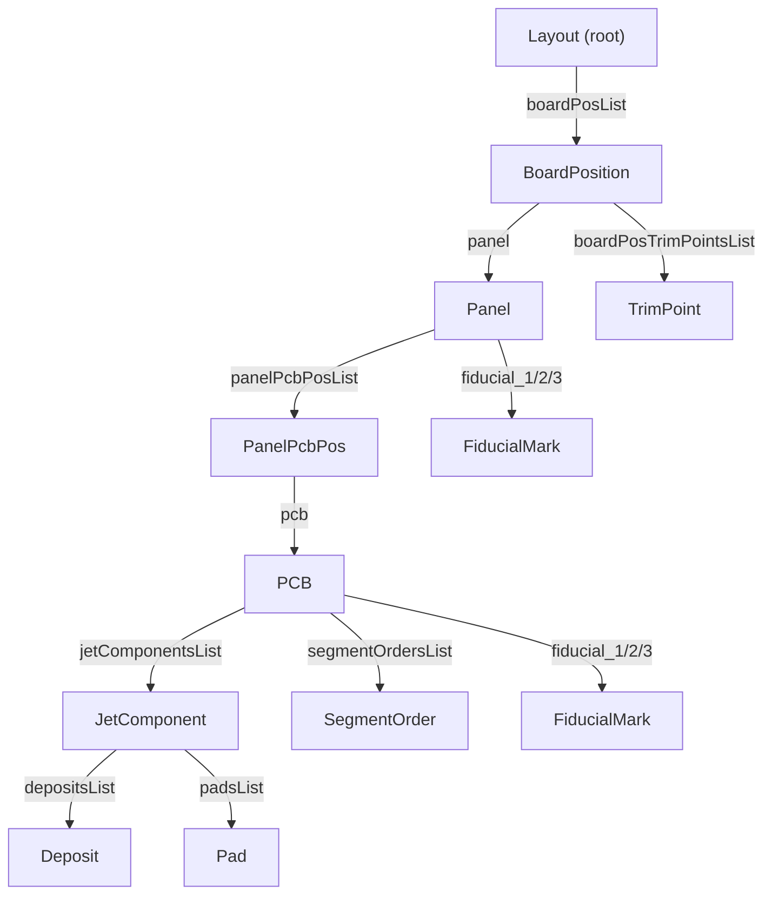

# MY600 Jet Printer

The **Mycronic MY600** is a high-precision solder paste jet printing system designed for stencil-free PCB assembly. Instead of forcing paste through a fixed stencil aperture, it deposits solder paste volumetrically, enabling dynamic, per-pad control of paste volume and geometry within a single print cycle.

## Core principle

The MY600 uses a piezo-driven ejector to dispense controlled droplets of solder paste. It dynamically adjusts droplet count, volume, spacing, and stacking pattern per pad. This enables immediate transitions between small and large deposits without hardware changes.

## Ejector types

| Property | AG04 (standard) | AR02 (fine-pitch) |
|---|---|---|
| Cassette Model ID | `2130714632` | `2130808852` |
| Default media | MY600 Senju M705-LFAC19 | AR Tamura T6 |
| Dot diameter range | 330 -- 520 µm | 219 -- 250 µm |
| Default dot period | 0.00333 s (~300 Hz) | 0.005 s (~200 Hz) |
| Typical velocity | 0.075 -- 0.115 m/s | 0.024 m/s |
| Requires FinePitch option | No | Yes |

The AR02 ejector produces smaller minimum droplets for finer-pitch deposits. It generates significantly more path segments per board because smaller dots require more passes to achieve the same volume.

## FinePitch option

Without the FinePitch option enabled, JPSys enforces a **minimum dot diameter of 300 µm**. Any segment with a smaller diameter is automatically increased to 300 µm on load. The AR02 ejector (219--250 µm dots) requires FinePitch to be enabled. FinePitch defaults to ON on current machines.

## Dot size behavior

With the standard AG04 ejector, typical printed dot diameters are approximately **0.33 -- 0.52 mm**. The MY600 can change deposit size for every individual pad on the board in real time during the same print cycle.

---

# JPSys JSON Format

The **JPSys JSON** is the native program format exported from MYCenter / JPSys for the Mycronic MY600 jet printer. A single `.json` file contains everything the machine needs to execute a print run: board layout, panel definitions, component positions, paste deposit geometries, paste volumes, and the optimized head movement path.

## Object hierarchy



| Level | Object | Description |
|---|---|---|
| 0 | **Layout** | Root. Board dimensions, machine coordinates, batch settings. |
| 1 | **BoardPosition** | One slot in the layout. Links to a Panel and TrimPoints. |
| 2 | **Panel** | Panelization container. Fiducials, bad-board tracking, PCB placements. |
| 3 | **PanelPcbPos** | Position of one PCB instance within the panel. |
| 4 | **PCB** | Full PCB program. Components, path segments, paste media, volumes. |
| 5a | **JetComponent** | A component placement with its deposits and pads. |
| 5b | **SegmentOrder** | One segment of the optimized jetting path. |
| 6 | **Deposit** / **Pad** | Individual paste deposit / copper pad footprint. |

## Units and conventions

| Quantity | Unit | Example |
|---|---|---|
| Spatial coordinates, sizes | µm | 1 mm = 1000 µm |
| Rotations | millidegrees | 90° = `90000` |
| Volumes | nL (nanoliters) | `160.59` |
| Time between dots (`dotPeriod`) | seconds | `0.00333` ≈ 300 Hz |
| Velocities (`vx`, `vy`) | m/s | `0.15` = 150 mm/s |
| Shape enum | integer | `1` = circular, `2` = rectangular |
| Timestamps | epoch milliseconds | `1771507297120` |

### The `#ref` pattern

JPSys uses a deduplication strategy for repeated objects. The **first occurrence** of a PCB or fiducial is fully serialized. Every **subsequent occurrence** is replaced with a compact back-reference:

```json
{ "id": 42, "#ref": true, "normalizedUcName": "MY_PCB" }
```

Consumers must resolve `#ref` objects by looking up the corresponding `id` from the first full definition.

## Volume calculation

### Base volume from deposit geometry

The nominal paste volume is derived from the deposit area and a virtual stencil thickness:

```
nominalVolume_nL = (deposit.sizeX × deposit.sizeY × stencilHeight) / 1,000,000
```

Where `stencilHeight` is approximately **127 µm** (5 mil).

### Volume percentage scaling

The volume percentage (90%, 100%, etc.) scales all three volume fields linearly:

```
nominalVolume = baseVolume × (volumePercent / 100)
minVolume     = nominalVolume × 0.9
maxVolume     = nominalVolume × 1.1
```

### Deposit shrink factor

Deposits are intentionally undersized relative to their pads. The default shrink factor is **0.96** (96%):

```
deposit.sizeX ≈ pad.sizeX × 0.96
deposit.sizeY ≈ pad.sizeY × 0.96
```

**Worked example** -- 2512 pad at 100% volume:

- Pad: 3401 × 2499 µm
- Deposit: 3401 × 0.96 = 3265 µm, 2499 × 0.96 = 2399 µm
- Area: 3265 × 2399 = 7,832,735 µm²
- Volume: 7,832,735 × 127 / 1,000,000 = **994.76 nL** (reference JSON: 994.92 nL)

## Oscillated movement (path planning)

The JPSys path compiler converts deposit geometries into an optimized sequence of `SegmentOrder` entries. The machine's Z-servo uses height measurement points to interpolate the correct jetting height for the start and stop of every strip.

### Strips

The fundamental unit of movement is a **strip**: one linear sweep across a deposit area. During a strip the head moves at constant velocity while ejecting dots at a fixed period. The dot spacing along a strip equals:

```
dotSpacing_µm = |velocity| × dotPeriod × 1,000,000
```

Each strip has a minimum dot count determined by its length and diameter -- the machine will not accept fewer dots than this minimum.

### Refill+

On each strip, the volume of the first dot can be boosted slightly if it would otherwise be smaller than subsequent dots. This is controlled by the **Refill Dwell** parameter in the cassette model (default 0). It compensates for the brief dwell time before the first ejection in a new strip.

### Serpentine pattern

Deposits wider than a single dot diameter are filled using a serpentine (back-and-forth) pattern. Consecutive strips alternate their velocity sign:

```
Strip 1:  vx = +0.10, vy = 0     → sweep right
Strip 2:  vx = -0.10, vy = 0     → sweep left
Strip 3:  vx = +0.10, vy = 0     → sweep right
```

Between strips the head repositions by one dot-pitch in the perpendicular direction. This minimizes travel distance and avoids lifting the head between adjacent lines.

### Component-level optimization

All strips belonging to the same component's deposits are grouped and ordered to minimize repositioning moves. Pads within a single component are visited in sequence.

### Global path ordering

Components are visited in a **nearest-neighbor** sequence across the entire PCB. The `orderNumber` field on each `SegmentOrder` reflects this global optimization. The machine's path optimizer groups segment orders and applies a nearest-neighbor algorithm to minimize total travel distance.

When **Online PCB Merge** is enabled, the machine overrides the offline compiler's path and re-optimizes across all PCBs in the panel as if they were a single PCB, using nearest-neighbor for groups of segment orders.

### Volume per segment (spherical cap model)

The volume of paste deposited by a single segment is calculated using a **spherical cap** model. Given the dot diameter and a contact angle parameter (set globally on the machine), the volume of each dot is:

```
V_dot = (π × h / 6) × (3r² + h²)
```

Where `r` is the dot radius and `h` is the cap height derived from the contact angle. The total segment volume is `V_dot × dotCount`.

## Height zones and Z control

Before jetting, the machine measures board height at designated points. These height measurement points are interpolated into a height matrix. The Z-servo uses this matrix to set the correct nozzle height at the start and end of every strip.

Height zones group deposits together with their measurement points. Each PCB gets at least one height zone by default (one zone per PCB). Height zones can be regenerated as:

- **One zone per PCB** -- default, each PCB gets its own zone
- **Single zone** -- all PCBs share one zone (faster for large panels)
- **Multiple zones** -- automatic clustering based on deposit grouping

The `z` field on each `SegmentOrder` reflects the planned jetting height (typically 0 for flat boards). For boards with cavities or height variations, the machine adjusts the Z position per-strip using the height zone data.

## Coordinate systems

Two coordinate systems are involved in panelization:

- **PCB coordinates** -- defined by the PCB's fiducial marks. Jet component positions (`x`, `y`) and deposit/pad offsets are in PCB coordinates.
- **Panel coordinates** -- defined by the panel's fiducial marks. The `PanelPcbPos` entries map each PCB's fiducials into panel coordinates via `x1/y1`, `x2/y2`, `x3/y3`.

The first fiducial defines the origin and the line from fiducial 1 to fiducial 2 defines the board angle.

## Field reference

### Layout (root)

| Field | Type | Description |
|---|---|---|
| `id` | integer | Unique identifier |
| `name` | string | Program name |
| `normalizedUcName` | string | Upper-case normalized name |
| `comment` | string | Structured metadata (see below) |
| `createTime` | integer | Creation timestamp (epoch ms) |
| `__modifiedTime` | integer | Last modification timestamp |
| `__modifiedCount` | integer | Modification counter |
| `modifiedBy` | string | Last modifier |
| `lifeCycleStatus` | string | `"PRELIMINARY"`, `"RELEASED"`, or `"DISCONTINUED"` |
| `clampForce` | string | `"NORMAL"`, `"LOW"`, or `"HIGH"` |
| `length` | integer | Board length along conveyor (µm). Zero = auto-measure. |
| `conveyorWidth` | integer | Conveyor rail width (µm). Range 30--508 mm. |
| `lowerLeftCornerX` | integer | Machine-coordinate X origin (µm) |
| `lowerLeftCornerY` | integer | Machine-coordinate Y origin (µm) |
| `batchSize` | integer | Batch size count |
| `batchSizeType` | string | `"LAYOUTS"` |
| `boardPosList` | array | Board position slots |

### Comment field metadata

The `comment` field stores structured metadata as a multi-line string:

```
Heinrich: Hier stehen Kommentare:
Purpose: AG04-M705-LFAC19 100%
Machine Type: MY500_S3
Compiler Settings: Default
```

### PCB

| Field | Type | Description |
|---|---|---|
| `totalVolume` | integer | Total paste volume (nL) |
| `executionTime` | integer | Estimated execution time (s) |
| `mediaCategory` | string | e.g. `"Paste, LeadFree"` |
| `cassetteModelId` | integer | Ejector type identifier |
| `media` | string | Paste media name |
| `dotCount` | integer | Total dots across all segments |
| `jetComponentsList` | array | Component placements |
| `segmentOrdersList` | array | Optimized jetting path |
| `inspectionThreshold` | integer | Inspection threshold (%) |

### JetComponent

| Field | Type | Description |
|---|---|---|
| `componentNumber` | integer | Sequential number |
| `name` | string | Reference designator (`R1`, `U3`) |
| `shapeName` | string | Package name (`0402`, `QFN48`) |
| `rotation` | integer | Rotation (millidegrees) |
| `x`, `y` | integer | Component center in PCB coords (µm) |
| `depositsList` | array | Paste deposits |
| `padsList` | array | Copper pads |

### Deposit

| Field | Type | Description |
|---|---|---|
| `depositId` | integer | Sequence number |
| `padId` | integer | Corresponding pad |
| `sizeX`, `sizeY` | integer | Deposit dimensions (µm) |
| `shape` | integer | `1` = circular, `2` = rectangular |
| `x`, `y` | integer | Position relative to component center (µm) |
| `nominalVolume` | number | Target volume (nL) |
| `minVolume` | number | Minimum acceptable volume (nL) |
| `maxVolume` | number | Maximum acceptable volume (nL) |

### SegmentOrder

| Field | Type | Description |
|---|---|---|
| `orderNumber` | integer | Execution sequence (ascending) |
| `x`, `y`, `z` | integer | Segment start position (µm) |
| `vx`, `vy` | number | Velocity components (m/s) |
| `diameter` | integer | Dot diameter (µm) |
| `dotPeriod` | number | Time between dots (seconds) |
| `dotCount` | integer | Dots in this segment |
| `arcSegmentRadius` | integer/null | Arc radius, null for straight |

## Gerbtrace integration

Gerbtrace's [Paste](/docs/viewer/paste) feature includes a jet print mode that simulates the MY600 dot deposition pattern on the board canvas. The JPSys export generates a complete program JSON including the optimized serpentine path that can be loaded directly onto the machine.
